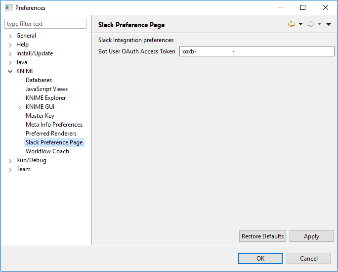
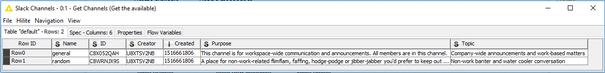
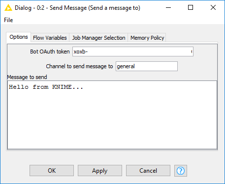
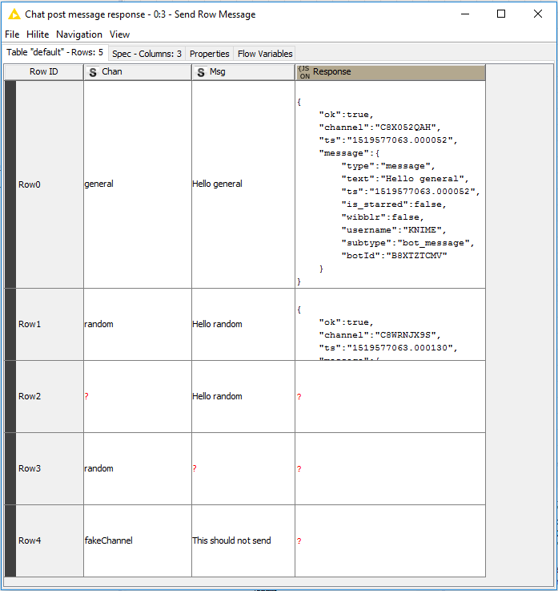
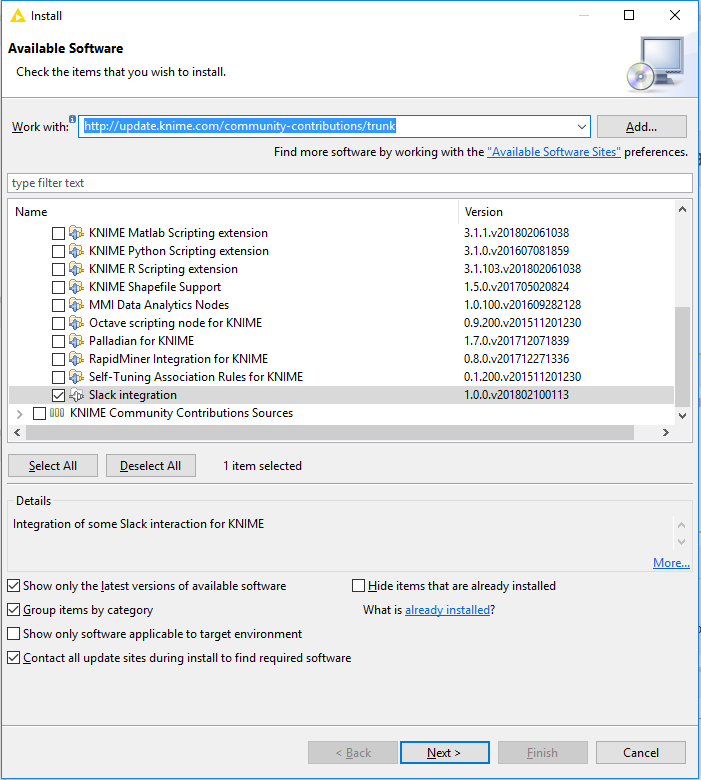

This repository contains a KNIME plugin which provides nodes interacting with Slack.

It uses the [jslack package](https://github.com/seratch/jslack) to interact with Slack. 

# Status

Current capabilities include:
* Get channel list
* Post single message to Slack from KNIME where channel and message are specified in the dialog
* Use values from a table to post multiple messages to slack

# Using the nodes

Create a bot in your Slack workspace see [https://api.slack.com/bot-users](https://api.slack.com/bot-users). Then provide the bots user OAuth token
in the KNIME preferences. See instructions from the [jslack library](https://github.com/seratch/jslack#setting-up-oauth--permissions-for-it).

Each node can override the preference with a new Bot token either allowing multiple bots in one Slack workspace or access to bots in different Slack workspaces.

On the 31/03/2020 the following works for setting up a knime-bot:

1. Navigate to [https://api.slack.com/apps](https://api.slack.com/apps)
2. Select Create New App and fill in the modal dialog with the App Name and Workspace
3. Select OAuth and Permissions
4. Under Scopes > Bot Token scopes add: channels:history, channels:read, chat:write, chat:write.public, groups:read, im:read, mpim:read, users:read
5. Select Install App / Reinstall apps

Use the Bot User OAuth Access Token in the KNIME nodes. 

Fewer scopes may be possible if you need less functionality.

## Preferences

The value specified in the KNIME / Slack preferences page will be used to auto populate the OAth token setting in each node.

## Nodes

### Get channels

Get the channels the bot user is able to see.

### Send message
This node can be placed at the start, middle or end of a workflow as the input port is optional. Use it to define a message within the dialog to
send upon execution. 

### Send row message

# Building and deployment

The nodes can be build manually in eclipse or via buckminster. The nodes are currently available in the KNIME community update site:

http://update.knime.com/community-contributions/trunk

# Running tests

For the tests to execute an environment variable 'SLACK_USER_OATH_TOKEN' must be configured 
with the Bots OAuth token. 